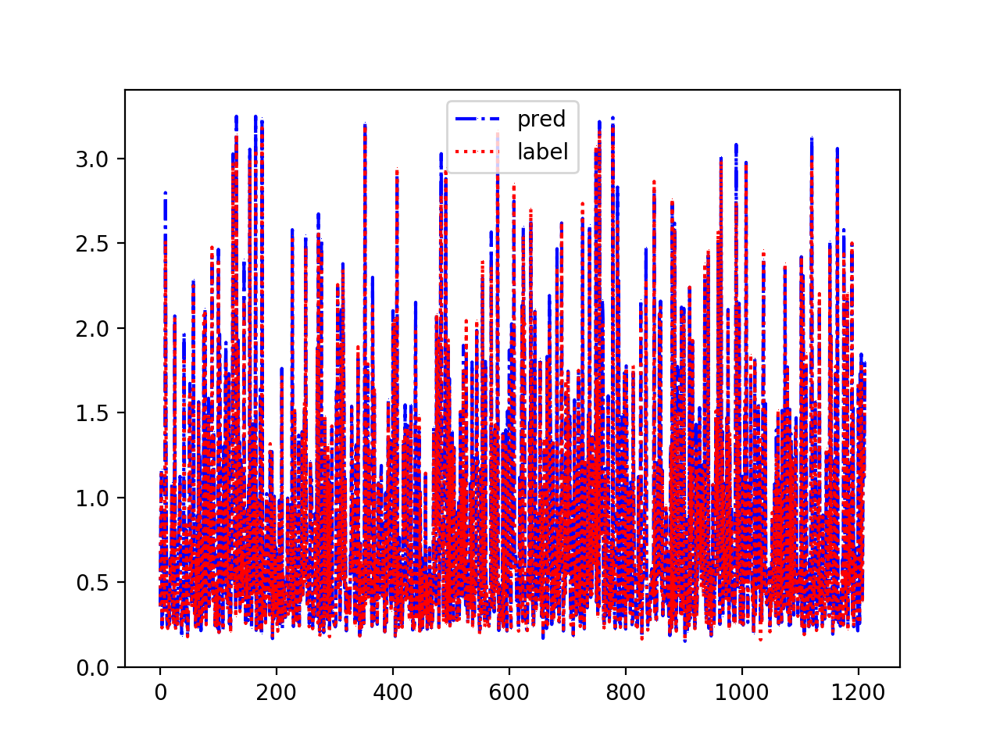

# lstm_stock_pred_pytorch
stock prediction via lstm using pytorch

## how to use
### dependences
  - torch
  - torchvision
  - tqdm
  - pandas
  - numpy
  - matplotlib
  
### train and validate
```python
pyhton ./lstm_stock_pred_pytorch.py -data_path=./dataset_1.csv
```
### result

